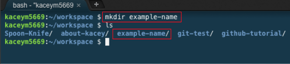

# GitHub Tutorial

_by Kacey Manzueta_

---
## Git vs. GitHub
#### Git 
* Git keeps screenshots of your code and does not require GitHub.  
#### GitHub
* GitHub stores you code in a cloud and you can visually track your changes and GitHub requires Git.
  * easier to collaborate 

---
## Initial Setup
You will need to set up an SSH key before coding. An SSH allows you to connect to your remote repo without needing to sign into your account everytime you `git push`.  

1. Go to github and look at the top-right click the profile icon and go into settings.
2. Look at the left-sidebar select SSH and GPG.
3. now click new SSH key. Title it Cloud9.
4. switch to cloud9 and click the gear icon on the top-right.
5. select the SSH key tab copy the second SSH key (starts with `ssh-rsa`)
6. Go back to github and paste the second SSH key there, and add the SSH key when you have pasted it.
7. now go back to cloud9 and open up your IDE (integrated development environment ).
8. in the terminal type `ssh -T git@github.com`
9. you should see `Warning: Permanently added 'github.com,192.30.253.112' (RSA) to the list of known hosts.
Hi username! You've successfully authenticated, but GitHub does not provide shell access.`
 10. you have finished setting up your SSH key !

---
## Repository Setup
1. To set up a repo (short for repository) you first have to set up a directory  
by typing  `mkdir <directory-name>` into the terminal. **make sure you are in**  `~/workspace`  

  
2. Then in the you will `cd <name>`. **always**`cd` into the directory after you make it. (`cd` also you to moke from directory to directory you would (`cd <directory-name>`)
3. Use `pwd` to check in the right directory, after you make sure type in `git init` which initializes git into the directory -> making it a repo.
4. Now that you have set up your repo in your Cloud9 you will need to set up your remote repo.
5. Go to github and on the top-right select the `+` and then click `new repository`
6. Put in the remote repo name the same as the name you gave the repo in Cloud9. Now Create repo
7. Now for the url make sure SSH is selected of you will not be able to `git push` to your `remote repo`.
8. Now type into the terminal on Cloud9 `git remote add origin git@github.com:username/repo-name.git` to connect your remote(github) to you local(Cloud9) then type `git push -u origin master`
9. You have connected your remote repo to your local repo.

---
## Workflow & Commands
---
###### General commands 
^ : the up arrow can be used as a shortcut to go to previous commands instead of rewriting the command again.  
  
(tab) : the tab button can also be used as a shortcut to auto complete a directories name  
  
Control D (C ) : will interupts commands incase you type it in wrong.  
  
`Clear` : typing `clear` into the terminal to clear the terminal. (you can also _command K_ to clear the terminal)   
  
`cd` : is used to navigate in and out of directories     
  
`..` : used to go back one directory. ex: ` cd ..`  
  
`pwd` (print working directory) : tells where you are, if you are in workspace, then `pwd` will tell you that you are in workspace.  
  
`~` : helps you get back home. ex: `cd ~ ` .
  
`ls` : it list out the files in the directory you are currently in.
  
`mkdir` : makes a directory. ex: `mkdir <directory-name>`
  
`touch` : makes a folder in the directory you are currently in. ex: `touch <folder-name>`  
  
`rm -rf` : removes directories. `rm -rf <directory-name>`  
  
`rm` : removes folders. `rm <folder-name>`  
  
`mv`: renames files. `mv <current-file-name> <new-name>`. Also you can move files. `mv <file-name> <destination>`.  

 ---
###### Important Commands 
`git init` : initializes git in the current directory. **this only needs to be done one time**  
  
`git status`: this helps you see which files have been edited since your last commit, and it also allows you to know which files need to me added to the "stage" inorder to commit. **you should used this often**
  
`git add`: is used to add a file to the "stage". `git add <file-name>`.  
  
`git add .`/`git add --all`: adds all the files that have been edited since the last commit to the "stage".  
`git commit -m`: commits/takes a snap shot of your code. `git commit -m "commit message"` **make sure the commit message is in present tense**

`git push`: pushes your commit to you remote repo, and when you refresh your remote repo you will see all your commits.

  

  

---
## Rolling Back Changes
`git checkout -- <file>`: used to discard changes made in a working directory. You do not have to remember this after making changes to a directory, then use `git status` anf you will see it as a choice.  
  
`git reset HEAD <file>`: used to unstage changes.